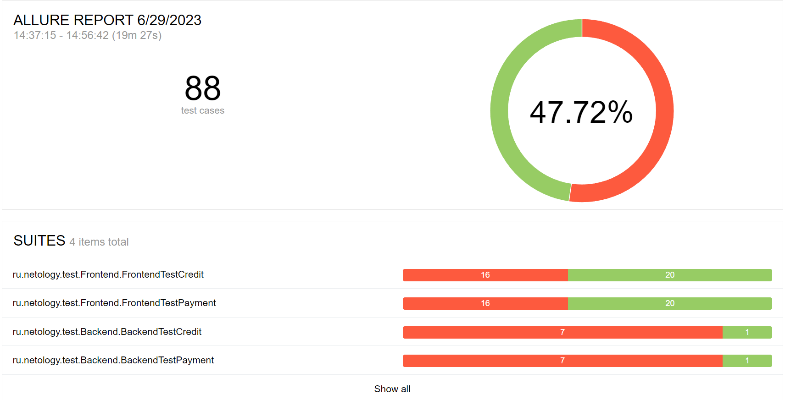

# Отчёт по итогам тестирования
Отчёт по результату автоматизированного тестированию функционала покупки и оформления кредита по данным карты веб-сервиса покупки тура
"Путешествие дня".

### Количество тест-кейсов
Всего было проведено 88 авто-теста. Общий процент успешных тестов равен 47.72%.

Результаты тестов не зависят от подключённой БД.

### Итоги:

|                  | Кол-во тестов | Passed | Failed | Passed, % |
|:-----------------|:-------------:|:------:|:------:|----------:|
| API тестирование |      16       |   2    |   14   |     12,5% |
| UI тестирование  |      72       |   40   |   32   |    55.56% |
| Всего            |      88       |   42   |   46   |    47.72% |

В результате прогона тестов было составлено 15 [баг-репортов](https://github.com/Helena1199/DiplomQA/issues).

## Рекомендации

- для увеличения testability SUT рекомендуется добавить элементам страницы атрибут test-id
- необходимо разработать техническую документацию по проекту
